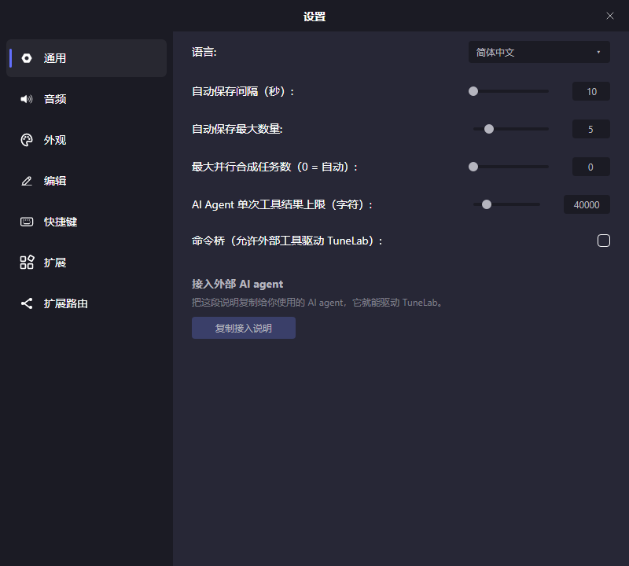
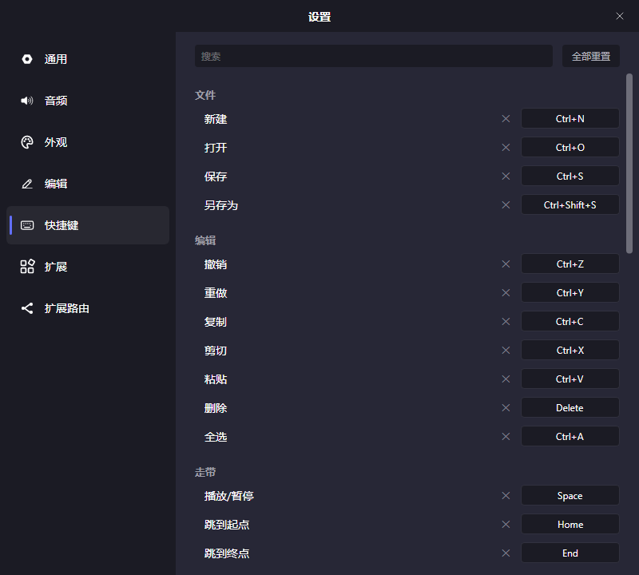
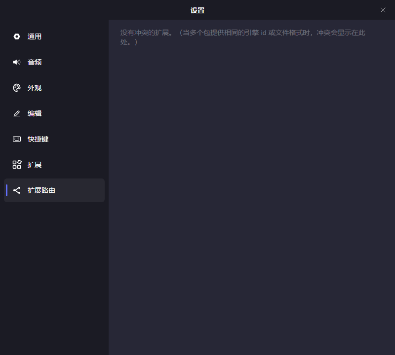

# TuneLab 用户手册

TuneLab 是一款**可扩展的歌声合成编辑器**：合成引擎、工程格式、音频效果器、乐器音源都由扩展提供，编辑器本身负责音符、歌词、音高、参数、音素这些「怎么唱」的编辑工作，并内置脚本与 AI Agent 做批量操作。

本手册覆盖界面的每一块、每种工具的操作手势、侧栏各页、设置项、文件与扩展管理。

> 插图里的「示例声源 · 澄」「示例乐器 · 正弦」是用于演示的占位插件；在你的机器上，这些位置显示的是你自己安装的引擎。

---

## 目录

1. [安装与启动](#1-安装与启动)
2. [界面总览](#2-界面总览)
3. [十分钟做完第一首](#3-十分钟做完第一首)
4. [轨道区（编排）](#4-轨道区编排)
5. [走带与功能栏](#5-走带与功能栏)
6. [钢琴窗：音符与歌词](#6-钢琴窗音符与歌词)
7. [钢琴窗：音高与颤音](#7-钢琴窗音高与颤音)
8. [钢琴窗：音素](#8-钢琴窗音素)
9. [钢琴窗：波形与合成状态](#9-钢琴窗波形与合成状态)
10. [参数面板](#10-参数面板)
11. [侧栏](#11-侧栏)
12. [设置](#12-设置)
13. [快捷键](#13-快捷键)
14. [文件、格式与自动保存](#14-文件格式与自动保存)
15. [扩展管理](#15-扩展管理)
16. [更新与排错](#16-更新与排错)
17. [命令行与外部工具](#17-命令行与外部工具)
- [附录：术语表](#附录术语表)

---

<!-- section: install -->
## 1. 安装与启动

Release 页面目前提供 Windows x64 两种包：

| 形态 | 文件名 | 说明 |
|------|--------|------|
| 安装器 | `TuneLab-Setup-win-x64-v<版本>.exe` | 安装到 `%LocalAppData%\Programs\TuneLab`（当前用户，无需管理员），可选关联 `.tlpx` / `.tlp` / `.tlx` 文件类型，注册卸载项。**只有安装版能就地自更新。** |
| 免安装 | `TuneLab-win-x64-v<版本>.zip` | 解压到任意目录运行 `TuneLab.exe`。不往目录外写任何东西，也不关联文件类型、不自更新。 |

两者都是**框架依赖**构建，需要 [.NET 8 Desktop Runtime](https://dotnet.microsoft.com/download/dotnet/8.0)（x64）。没装运行时的机器首次启动会被引导到微软的下载页。

程序未做代码签名，首次启动 Windows 可能弹 SmartScreen（"Windows 已保护你的电脑"），选 **更多信息 → 仍要运行** 即可。

其他平台请自行从源码构建。

### 用户数据放在哪

除程序本体外，TuneLab 的一切用户数据都在 `%APPDATA%\TuneLab`：

| 位置 | 内容 |
|------|------|
| `Configs\Settings.json` | 设置窗里的全部设置 |
| `Configs\Keybindings.json` | 你改过的快捷键（只存差量，未改的项继承默认） |
| `Configs\EditorState.json` | 窗口位置、面板高度这类界面状态 |
| `Configs\ExtensionActivation.json` | 扩展与单个能力的启停 |
| `Configs\ExtensionRouting.json` | 多个扩展提供同一能力时选了谁 |
| `Configs\ParameterPins.json` | 钉在参数面板上的属性 lane |
| `Extensions\` | 已安装的扩展（每个包一个子目录） |
| `Scripts\` | 你保存的脚本 |
| `AgentSessions\` | AI Agent 的会话记录 |
| `AutoSave\` | 自动保存的备份 |
| `Logs\` | 运行日志 |

菜单 **帮助 → 打开 TuneLab 文件夹 / 打开日志** 可直达。

---

<!-- section: ui-overview -->
## 2. 界面总览


| # | 区域 | 作用 |
|---|------|------|
| ① | **菜单栏** | 文件 / 编辑 / 脚本 / 帮助。标题栏中间显示当前工程名（未保存的改动会体现在标题上）。 |
| ② | **轨道区（编排区）** | 整首歌的横向布局：轨道、片段、时间轴（节奏与拍号）。 |
| ③ | **功能栏** | 走带控制、时间码、五个编辑工具、量化设置。 |
| ④ | **钢琴窗** | 编辑「当前打开的那个片段」：音符、歌词、音高、颤音、音素、参数。 |
| ⑤ | **侧栏** | 当前页签的面板内容，宽度可拖。 |
| ⑥ | **侧栏页签条** | 自上而下：片段属性、音符属性、Agent、脚本、扩展、导出；最下方的齿轮打开**设置**窗。 |

轨道区与钢琴窗之间的分界可以上下拖动（功能栏就是那条分界）；侧栏左缘可以左右拖动；再次点击已选中的页签会收起侧栏。

---

<!-- section: quick-start -->
## 3. 十分钟做完第一首

1. **准备引擎**：先安装一个歌声合成引擎扩展（见[扩展管理](#15-扩展管理)）。没有引擎也能编辑，只是听不到歌声。
2. **新建工程**：`Ctrl+N`。默认带一条轨道、一个空片段。
3. **选声源**：在轨道区右键那个片段 → **设置声源**，挑一个音色。
4. **打开片段**：双击片段，它就出现在下方钢琴窗里。
5. **写音符**：确认工具是**音符工具**（功能栏第 1 个，快捷键 `1`），在钢琴窗空白处**双击**建一个音符，按住不放向右拖可以直接定长度。
6. **填歌词**：双击音符输入歌词；或框选一串音符后右键 → **输入歌词**，一次把整句填进去。
7. **试听**：`Space` 播放/暂停，`Home` 回到开头。合成是后台增量进行的，钢琴窗顶部的细状态条会显示每一段的合成进度。
8. **修音高**：切到**音高画笔**（`2`）在音符上画线；不满意就用**锚点工具**（`3`）微调锚点。
9. **导出**：侧栏 **导出** 页选路径、格式与轨道，点「导出」；只想快速导一个整混 WAV 的话，用菜单 **文件 → 导出混音文件**。
10. **保存**：`Ctrl+S`。默认存成 `.tlpx`。

---

<!-- section: arrangement -->
## 4. 轨道区（编排）


| # | 区域 | 说明 |
|---|------|------|
| ① | **轨道头** | 每条轨道的序号（带轨道颜色）、名称、`M`（静音）/`S`（独奏）、增益与声像两个滑条，右缘还有实时电平表。 |
| ② | **时间轴** | 小节刻度、拍号、速度标记，单击可移动播放头。 |
| ③ | **片段区** | 每条轨道上的片段。歌声/乐器片段显示音符缩略图，音频片段显示波形与文件路径。 |

### 轨道操作

- 菜单 **文件 → 添加轨道**，或在片段区空白处右键 → **导入音频轨道 / 导入工程轨道**。
- 轨道头右键：**导出音频**（单独导这一轨）、**上移**、**下移**、**设置颜色**、**作为参考**（把该轨作为参考显示/隐藏在钢琴窗背景里）、**删除**。
- 轨道名与序号都是**可就地编辑的标签**：双击名字改名；双击序号输入新序号，轨道即移到那个位置。
- 增益、声像、静音、独奏都是即时生效的，不影响导出以外的任何数据。
- 新建轨道的颜色按「轨道色相变化速率」设置自动错开（见[外观设置](#123-外观)）。

### 片段操作

- **移动**：拖动片段本体（可跨轨道）。
- **裁剪**：拖片段左右边缘。歌声/乐器片段的裁剪只改变可见/发声范围，音符本身不丢。
- **打开**：双击片段 → 在钢琴窗里编辑。`Ctrl+Tab` 可以重新打开上一个片段。
- **右键菜单**：剪切 / 复制 / 删除、**重命名**、**拆分**（在光标位置切开）、**合并**（多选后合成一个）、**设置声源** / **设置乐器**（含「最近使用」与「内建」）、**去除重叠**、**导出音频**（只导这个片段）。
- 音频片段若文件被移动过，会显示「音频加载失败，双击以重新链接」，双击即可重新指定文件。

### 时间轴：速度与拍号

在时间轴上右键：

- **添加节奏 / 编辑节奏 / 删除节奏**：在该位置插入一个 BPM 变化点。
- **添加节拍 / 编辑节拍 / 删除节拍**：从该小节起改变拍号。

工程起点的速度与拍号总是存在，不能删除，只能编辑。

### 范围选区（DAW 式常驻选区）

按住 **Shift** 在片段区拖动，会画出一个「时间 × 轨道」的常驻选区——不需要切换到任何选择工具，任何工具下都能画。选区画好后：

- 在选区里右键：**复制选区 / 剪切选区 / 删除选区**，以及**粘贴**（粘在光标处）。二级菜单里还能只针对某一类数据（音符 / 音高 / 颤音 / 参数）操作。
- 在选区外右键：只给粘贴族——复制完把选区清掉，仍然可以在别处粘贴。
- 单击空白处即清除选区。

侧栏「导出」页的**导出范围**可以设成「选区」，配合这个选区导出片段化的音频。

---

<!-- section: transport -->
## 5. 走带与功能栏


从左到右：**播放/暂停**（`Space`）、**自动翻页**（播放时视图是否跟着播放头走，可选跟随目标）、**跳到起点**（`Home`）、**跳到终点**（`End`）、**时间码**（播放头的绝对时间，毫秒段小字显示）。

中间五个是编辑工具，作用于钢琴窗：

| # | 工具 | 快捷键 | 干什么 |
|---|------|--------|--------|
| ① | 音符工具 | `1` | 建/移/缩放音符，改歌词 |
| ② | 音高画笔 | `2` | 手绘音高曲线 |
| ③ | 锚点工具 | `3` | 编辑音高曲线的锚点 |
| ④ | 固定笔刷 | `4` | 把引擎合成出的音高「固定」成可编辑的用户曲线 |
| ⑤ | 颤音工具 | `5` | 添加与调整颤音 |

最右边的**量化**下拉决定所有拖动的吸附格：`1/1`～`1/32`（二分族）、`1/3`～`1/96`（三分族）、`1/5`～`1/80`（五分族）。任何拖动中按住 **Alt** 都可临时免吸附。

---

<!-- section: notes-and-lyrics -->
## 6. 钢琴窗：音符与歌词


| # | 区域 | 说明 |
|---|------|------|
| ① | **钢琴键** | 纵向音高标尺。点键试听（按住拖过多个键可连续试听），音色取自设置里的「钢琴音采样」。 |
| ② | **音符区** | 音符、歌词、发音、音高曲线、颤音、参考轨都画在这里；下部是波形/音素带。 |
| ③ | **参数页签条** | 点亮哪条参数轨，参数面板就编辑哪一条。 |

### 音符编辑（音符工具）


| 操作 | 手势 |
|------|------|
| 新建音符 | 在空白处**双击**（长度 = 当前量化格），按住继续拖可直接定长 |
| 框选 | 在空白处拖动 |
| 加选 / 减选 | `Ctrl` + 单击 |
| 移动 | 拖音符本体 |
| 只改音高不动位置 | `Shift` + 拖音符本体（约束移动） |
| 改起点 / 终点 | 拖音符左 / 右边缘 |
| 免吸附 | 拖动时按住 `Alt` |
| 升 / 降半音 | `↑` / `↓` |
| 升 / 降八度 | `Shift+↑` / `Shift+↓` |
| 删除 | `Delete` |
| 全选 | `Ctrl+A` |
| 在光标处切分 | 右键音符 → **拆分** |

音符右键菜单还有：**输入歌词**、**按音素拆分**、**锁定音素** / **清除锁定音素**、**去除重叠**、**升/降八度**、**由此前置歌词** / **由此后置歌词**（把一串音符的歌词整体往前/往后挪一位）、复制 / 剪切 / 删除、以及**在参数栏编辑**（把某个音符属性钉成参数 lane）。安装了脚本工具时，适用于音符的脚本也会出现在这里。

### 钢琴窗里的范围选区

钢琴窗也有常驻范围选区，但它是**一条时间带**（只有横向范围，与音高无关）：在空白处按 **Shift** 拖动即可画出。它与编排区的选区各自独立并存。

- 带内右键：**复制选区 / 剪切选区 / 删除选区**，以及**粘贴**；二级菜单可只针对音符 / 音高 / 颤音 / 参数中的某一类。
- 有选区时，`Ctrl+C` / `Ctrl+X` / `Delete` 作用于选区而不是当前选中的音符。
- 单击空白处清除选区。
- 例外：音符工具下 `Shift` + 拖**音符本体**是「约束移动」，不是画选区——落在对象上就是操作对象，落在空处才是造区。

### 歌词与发音


双击音符即可就地改歌词；选中多个音符后右键 **输入歌词**，可以一次输入整句，按顺序分配到各音符，勾选**跳过延音符**可以跳过用作延音的音符。

- **歌词**是你写的字，**发音**是喂给引擎的音素来源。发音为空时由引擎自己决定怎么念；一旦写了发音，它就是**显式覆盖**。
- 设置里的**录入歌词时自动生成发音**（G2P）打开后，输入歌词的那一刻编辑器会把汉字转拼音、假名转罗马字填进发音字段。它只在**写入**时起作用，不会在读取时替你猜。
- 多音字：音符上方的发音标签可以点开，从引擎/词典给出的候选里挑一个。
- 用 `-`（延音符）表示「上一个字继续唱」。一个记号算不算延音由引擎判定，编辑器照单执行。

---

<!-- section: pitch-and-vibrato -->
## 7. 钢琴窗：音高与颤音

### 音高曲线


未编辑时，音符上的白线是引擎给出的音高。用**音高画笔**（`2`）直接在音符区手绘就会写下你自己的曲线：

- 主键拖动 = 画线；`Ctrl` + 拖 = **定值绘制**（锁住按下时的高度画水平线，用于「这一段保持不动」）。
- 曲线是分段的：抬笔留下的空隙就是「此处没有用户曲线」，那里仍由引擎决定。

**锚点工具**（`3`）编辑同一条曲线的锚点：


- 空白处**双击** = 插入锚点并直接拖动；拖锚点 = 移动；`Ctrl` + 单击 = 加选。
- 右键锚点 = 删除；右键拖动 = 沿路擦除锚点。

**固定笔刷**（`4`）解决另一个问题：引擎合成出来的音高本身不是可编辑数据，横向刷过一段，就把这一段的**合成音高固定成用户曲线**（之后可以用画笔/锚点继续改）；右键刷过则擦除固定。

### 颤音


切到**颤音工具**（`5`）：

- 悬停在还没有颤音的音符上，会出现预览，单击即落实一个颤音（从鼠标位置到音符结尾）。
- 拖颤音本体 = 移动；拖左右两端 = 改起止；拖幅度柄 = 改振幅；另有频率柄与相位柄。
- 颤音的起振/收束由 `Attack` / `Release` 控制，画面上能直接看出包络（上图末字）。
- 颤音的作用强度受**颤音包络**参数轨调制；如果某处颤音包络为 0，参数区会提示「此处无值，颤音不生效」。颤音也可以拖到别的参数轨上去调制那条轨（参数区会提示「拖拽以关联颤音」）。

---

<!-- section: phonemes -->
## 8. 钢琴窗：音素


音符区下部那条带子里显示每个音符**实际唱出的音素**（符号 + 分界线）：合成完成后由引擎回报，音符上方同时显示该音符的发音（图中的 `wan`）。

| 操作 | 手势 |
|------|------|
| 改某个音素的时长 | 拖它的分界线（会隐式**锁定**该音符的音素——把合成产物固定成你的数据） |
| 在带子上半区切分音符 | 单击（悬停时有虚线预览落刀位置） |
| 就地改音素符号 | 在带子下半区**双击**：输入新符号；用空格分隔可拆成等分的多个音素；清空则删除 |
| 缩放音符首尾 | 在带子里直接拖 note 头 / 尾（分界即 noteon/noteoff） |
| 锁定 / 解除 | 音符右键 → **锁定音素** / **清除锁定音素** |
| 按音素切分音符 | 音符右键 → **按音素拆分** |

音素的更细粒度属性（引擎声明的每音素参数，如重音、偏移）在侧栏**属性 → 音素**面板里编辑，见[侧栏](#111-属性页)。

---

<!-- section: waveform-and-synthesis -->
## 9. 钢琴窗：波形与合成状态


- **波形**：音素带所在的泳道可以切换显示合成出来的音频波形。它和音素带共用同一条泳道（标题栏左侧的「波形」开关控制）。
- **合成状态带**：音符区顶部的细条按段显示合成状态——**待合成 / 合成中（带进度）/ 已合成 / 合成失败**，效果器处理阶段会显示「正在处理效果器：X（i/n）」这类文案。失败段是红色的，悬停显示报错，**右键即把报错文案复制到剪贴板**。
- 效果器失败时会退回播放未处理音频，并在状态带上说明（「正在播放未处理音频」）。

---

<!-- section: parameters -->
## 10. 参数面板


参数面板在钢琴窗下半部分，`Ctrl+P` 显示/隐藏（也可以拖动它的标题栏改高度）。底部页签条列出当前片段可用的所有参数轨：

- **内置**：音量（±12 dB）、颤音包络。
- **声源声明的轨**：由引擎决定，比如上图中示例声源声明的「气声」「弯音」「能量」。
- **效果器声明的轨**：挂在片段效果链上的每个效果器都可以声明自己的参数轨。
- **属性 lane**：从音符/音素属性「在参数栏编辑」钉过来的轨。
- **回显轨（只读）**：引擎报告的「它实际用了什么值」。回显轨与同名的实参轨配对——点亮实参轨会连带显示回显，右键可以把回显**烘焙**进实参轨，之后就在这个底子上继续改。


编辑手势：

| 操作 | 手势 |
|------|------|
| 画曲线 | 主键拖动 |
| 定值绘制（水平线） | `Ctrl` + 拖动 |
| 擦除 | 右键拖动 |
| 编辑锚点 | 锚点工具（`3`）下拖锚点、双击插入、右键删除 |
| 固定回显 | 固定笔刷（`4`）横刷 |
| 页签右键 | **从参数栏移除**、**显示/隐藏参数面板** |

轨的量程端点会显示引擎给的说明文本（图中的「平直 / 沙哑」）。分段轨（没有基线值的轨）在没画的地方就是「无值」，与连续轨的默认值语义不同。

---

<!-- section: sidebar -->
## 11. 侧栏

侧栏页签自上而下是：**片段属性**、**音符属性**、**Agent**、**脚本**、**扩展**、**导出**。点击已选中的页签可收起侧栏。

### 11.1 属性页


上方标题显示当前编辑对象。片段属性从上到下：

- **预设**：把整套片段设置（声源、参数默认值、效果链等）存成预设、随时套用；`...` 按钮管理保存/删除。
- **声源**：当前声源（歌声或乐器），可直接换。
- **属性**：增益，以及引擎声明的片段级属性（图中「启用气声」这类开关会**连带决定某些参数轨是否出现**——取消勾选后已画的曲线会保留隐藏，重新勾选原样恢复）。
- **参数**：各参数轨的默认值（曲线未覆盖处取这个值）。
- **效果**：片段的效果链，「+ 添加效果」挂上新效果器，链上可排序、删除、逐个展开参数。


切到「音符」页签时显示选中音符的属性（引擎声明的音符级参数，如张力、力度），以及**音素**属性（逐 slot 显示：核音素与辅音音素的可编辑字段可以不同）。多选时字段会合并显示，改动扇出到所有选中对象；值不一致处显示「(多个)」。

### 11.2 导出页


- **导出路径**、**文件名**、**导出范围**（全曲 / 选区——这里的「选区」指[编排区的范围选区](#范围选区daw-式常驻选区)，没有选区时会提示）。
- **轨道**：勾选要导出的轨道（含 Master 总混），每条可单独选**单声道/立体声**；「全选 / 全不选」快速切换。勾多条就是一次导出多个文件，文件名形如 `文件名_轨道名.wav`，导出过程有进度窗（第 i/n 条 + 当前轨道名）。
- **格式**：WAV / MP3 / FLAC / OGG。选 WAV/FLAC 时下面是**采样率**与**位深度**，选 MP3/OGG 时是**比特率**。
- 这些选项随工程保存，下次打开还在。

> 只想要一个整混 WAV：菜单 **文件 → 导出混音文件** 更快。

### 11.3 脚本页


用一小段 JavaScript 批量编辑工程——「5–8 小节每个音符升八度再加三度和声」这种事写成循环远比手点几十次划算。

- 顶部下拉是当前脚本（新脚本叫「未命名」），右边 `...` 里是**新建 / 打开 / 导入 / 保存 / 另存为 / 重命名 / 删除**；保存的脚本放在 `%APPDATA%\TuneLab\Scripts`。
- 中间是带行号与语法高亮的编辑器（新脚本预置了几行注释提示 `tl` 是入口）。点 **Run** 或 `Ctrl+Enter` 运行，下方输出区显示 `print` 的内容与运行结果。
- 点 **Doc** 切到随程序附带的**脚本 API 手册**（也在 `Resources/ScriptDoc/`）：对象模型、坐标口径、增删改接口都在里面。
- **整段脚本 = 一个撤销单位**：`Ctrl+Z` 一步回退；脚本中途报错则已做的改动全部回滚，工程不受影响。
- 写了 `getScriptInfo` 的脚本会**自动出现在菜单「脚本」里**（按 category 分组），按声明的适用范围也会出现在音符/片段等右键菜单里，并且可以在设置的快捷键页绑定快捷键。

### 11.4 Agent 页


内置 AI Agent 能读工程、调用编辑器的动作面（本质上就是脚本页那套 API）来替你改工程。

- 齿轮打开**模型设置**：选模型提供方、填接口地址/API 密钥/模型名等。未连接时输入框上方会提示先去设置里选模型。
- **授权档位**（顶部下拉）：
  - **确认**——每次改动都要你点「应用」；
  - **只读**——只给建议，绝不落笔；
  - **自动**——自动应用。
- 每次改动都会在对话里显示「Agent 想对工程应用 N 处改动」，可**应用 / 拒绝 / 重试**；涉及设置、快捷键、扩展启停、覆盖脚本文件等敏感动作会单独征求确认。
- ☰ 管理历史会话（新建、重命名、删除），会话存在 `%APPDATA%\TuneLab\AgentSessions`。
- 输入框可附图；下方显示 token 计量（当前上下文 / 本轮 / 会话累计）。
- 被中断的一轮会如实留痕（哪一步停的、有没有半截回复），可以点「继续」。
- **用法问题也可以直接问它**（「颤音怎么画」「导出选区在哪」）：它会去查随软件发布的这本手册再回答，而不是凭印象；问「我这台机器上某个快捷键/设置现在是什么值」时它查的是实时注册表。
- 工具清单与权限细节见 [agent-tools.md](agent-tools.md)；想让**外部**工具（终端命令、CI、别的 AI 客户端）也驱动 TuneLab，见[命令行与外部工具](#17-命令行与外部工具)。

### 11.5 扩展页


见[扩展管理](#15-扩展管理)。

---

<!-- section: settings -->
## 12. 设置

侧栏页签条最下方的齿轮打开设置窗。左侧七页，改动即时写盘；标注「需重启」的项要重启 TuneLab 才完全生效。

### 12.1 通用



| 设置 | 说明 |
|------|------|
| 语言 | 界面语言（**需重启**）。默认跟随系统。 |
| 自动保存间隔（秒） | 10–60，默认 10 |
| 自动保存最大数量 | 保留几份备份，1–20，默认 5 |
| 最大并行合成任务数 | 0 = 自动（按 CPU 决定），默认 0 |
| AI Agent 单次工具结果上限（字符） | 限制单个工具返回喂给模型的量，默认 40000（约 1 万 token），0 = 不限 |
| 命令桥（允许外部工具驱动 TuneLab） | 默认关。打开后终端里的 `tunelab` 命令、CI 脚本与支持 MCP 的 AI 客户端可以驱动这个编辑器，见[命令行与外部工具](#17-命令行与外部工具) |

### 12.2 音频


| 设置 | 说明 |
|------|------|
| 总增益（分贝） | −24 ~ +24，默认 0，拖动即生效 |
| 音频驱动 / 音频设备 | 运行时枚举当前系统可用项 |
| 采样率 | 32000 / 44100 / 48000 / 96000 / 192000，默认 44100 |
| 缓冲区大小 | 64 ~ 8192，默认 1024（越小延迟越低，越容易爆音） |
| 钢琴音采样 | 点击钢琴键试听用的 SoundFont（`.sf2`），留空用内置钢琴 |

### 12.3 外观


| 设置 | 说明 |
|------|------|
| 界面字体 | 从系统字体里选；留空走内置字体 + 按语言优化的回退链 |
| 自定义背景图 | 编辑器背景图片（png/jpg/bmp/gif/webp） |
| 背景图不透明度 | 0 ~ 1，默认 0.5，拖动即生效 |
| 轨道色相变化速率（度/秒） | 新建轨道自动配色的色相推进速度，−720 ~ 720，默认 0 |

### 12.4 编辑


| 设置 | 说明 |
|------|------|
| 参数边界扩展（tick） | 画曲线 / 固定回显写入时，端点向外多写的容差（1–60，默认 5） |
| 参数同步模式 | 打开后**拖动音符时，音高线与参数曲线随之平移**（默认关闭：曲线留在原处） |
| 自动生成发音 | 录入歌词时跑 G2P（汉字→拼音、假名→罗马字）填进发音字段；只作用于写入那一刻。默认开启 |

### 12.5 快捷键



- 按功能分组（文件 / 编辑 / 走带 / 音符 / 片段 / 轨道 / 视图 / 应用 / 脚本），上方可搜索。
- 点右侧的手势按钮开始录制，直接按你想要的组合；`×` 解除绑定。
- 冲突会当场提示：**同一区域**内撞了会问你要不要改绑，并说明当前哪条生效；**跨区域**同键则两者都保留，以聚焦区域的绑定优先。
- 「重置为默认」按条恢复，「全部重置」一次恢复所有。
- 只保存**差量**：没改过的项会跟着以后的版本更新默认值。
- 脚本工具也在这里绑定（默认无快捷键）。

### 12.6 扩展


列出**声明了设置项的扩展**，逐个展开就地编辑。没有可配置扩展时显示提示文字。扩展设置与 TuneLab 自己的设置分开存放，不进 `Settings.json`。

### 12.7 扩展路由



当**多个包提供同一个能力**（同一个引擎 id、或同一种文件格式）时，在这里选用哪一个，按 声源 / 乐器 / 效果 / 格式（导入、导出）分类列出。改动**重启后生效**。没有冲突时这一页是空的。

---

<!-- section: shortcuts -->
## 13. 快捷键

默认绑定（完整表由工具从运行中的命令注册表导出，见 [generated/keybindings.md](generated/keybindings.md)）：

| 命令 | 默认键 | 命令 | 默认键 |
|------|--------|------|--------|
| 新建 | `Ctrl+N` | 播放 / 暂停 | `Space` |
| 打开 | `Ctrl+O` | 跳到起点 | `Home` |
| 保存 | `Ctrl+S` | 跳到终点 | `End` |
| 另存为 | `Ctrl+Shift+S` | 重新打开上一个片段 | `Ctrl+Tab` |
| 撤销 | `Ctrl+Z` | 显示/隐藏参数面板 | `Ctrl+P` |
| 重做 | `Ctrl+Y` | 全屏 | `F11` |
| 用户手册 | `F1` | | |
| 复制 / 剪切 / 粘贴 | `Ctrl+C` / `X` / `V` | 音符工具 … 颤音工具 | `1` … `5` |
| 删除 | `Delete` | 升 / 降半音 | `↑` / `↓` |
| 全选 | `Ctrl+A` | 升 / 降八度 | `Shift+↑` / `Shift+↓` |

作用域说明：`↑ ↓` 这类只在钢琴窗生效，编辑区级命令在编排区与钢琴窗都生效；内层区域优先。

常用修饰键：

| 修饰键 | 含义 |
|--------|------|
| `Shift` + 拖（空白处） | 画范围选区 |
| `Shift` + 拖（音符本体，音符工具） | 约束移动：只改音高 |
| `Ctrl` + 单击 | 加选 / 减选 |
| `Ctrl` + 拖（画笔类） | 定值绘制（水平线） |
| `Alt` + 拖 | 临时免吸附 |
| 右键 + 拖（画笔类） | 擦除 |
| 中键拖 | 平移视图（编排区与钢琴窗通用） |
| 滚轮 | 纵向滚动（钢琴窗滚音高、编排区滚轨道） |
| `Shift` + 滚轮 | 横向平移时间 |
| `Ctrl` + 滚轮 | 横向缩放（以指针处为轴） |
| `Ctrl+Shift` + 滚轮 | 纵向缩放音高（仅钢琴窗） |
| 触控板双指横滑 | 横向平移时间 |

---

<!-- section: files -->
## 14. 文件、格式与自动保存

### 工程格式

| 后缀 | 说明 |
|------|------|
| `.tlpx` | TuneLab 工程（CBOR），**默认保存格式** |
| `.tlp` | TuneLab 工程（JSON），文本可读 |
| `.mid` / `.midi` | MIDI，导入导出都支持（只承载音符与时间信息） |

更多工程格式（其他软件的工程文件）由**格式扩展**提供，装上后自动出现在打开对话框与 **文件 → 导出为** 子菜单里。

### 导入

- **文件 → 导入音频轨道**：wav / mp3 / flac / ogg / aiff（aif、aifc）。
- **文件 → 导入工程轨道**：从另一个工程里挑轨道导进来。对话框可选**与工程对齐节奏**、**导入节奏**、**导入节拍**。
- 直接把工程文件拖进窗口也能打开；拖 `.tlx` 进来则是安装扩展。

### 导出

| 入口 | 产出 |
|------|------|
| 侧栏 **导出** 页 | 逐轨/总混音频，可选格式、采样率、位深/比特率、范围 |
| **文件 → 导出混音文件** | 一个整混 WAV |
| **文件 → 导出为 → …** | 工程文件（MIDI 或格式扩展提供的格式） |
| 片段右键 → **导出音频** | 只导这一个片段 |

### 自动保存与崩溃恢复

- 按设置的间隔自动备份到 `%APPDATA%\TuneLab\AutoSave`，最多保留设定的份数。
- 上次异常退出后再启动会问：「程序异常退出。要打开自动备份文件么？」
- 从备份恢复出来的工程，菜单 **文件 → 存回原位** 可以把它写回原来的文件（会先确认「用恢复出来的内容替换这个文件？」）。这一项只在「当前工程来自崩溃恢复且原文件仍在」时出现。

---

<!-- section: extensions -->
## 15. 扩展管理

TuneLab 的合成引擎、乐器、效果器、工程格式都是扩展（`.tlx` 包）。

### 安装与卸载

- **拖进窗口**：把 `.tlx` 拖到编辑器里。
- **侧栏扩展页 → 安装扩展**：选文件安装。
- 安装/卸载都在**重启后生效**；卸载会先标成「待卸载」，可以撤销（「取消卸载」）。
- 「打开扩展文件夹」直达 `%APPDATA%\TuneLab\Extensions`。
- 已装扩展显示为卡片：图标、名称、版本、作者、类别徽标（Voice / Instrument / Effect / Format …）。点卡片打开**详情窗**，显示作者写的说明文档（`introduction`）；旧版（legacy）扩展没有 manifest，能力靠扫描发现，详情窗会明确说明这一点。

### 启停

详情窗里可以**按包**或**按单个能力**启停（重启后生效）。整个包被禁用时，包内单个能力不能单独开启。启停选择存在 `Configs\ExtensionActivation.json`。

### 冲突与路由

两个包提供同一个引擎 id 或同一种文件格式时，去 **设置 → 扩展路由** 指定用哪个（重启生效）。

### 自己写扩展

见 [plugin-development.zh-CN.md](plugin-development.zh-CN.md)（英文版 [plugin-development.md](plugin-development.md)）。SDK 的演进规则见 [sdk-api-evolution.md](sdk-api-evolution.md)。

---

<!-- section: troubleshooting -->
## 16. 更新与排错

- **用户手册**：菜单 **帮助 → 用户手册**（`F1`）在应用内打开本手册——左侧目录点一下即跳到对应章节，正文里的插图**点击可放大**（滚轮缩放、拖动平移、`Esc` 关闭），不需要联网。
- **检查更新**：菜单 **帮助 → 检查更新...**。有新版时弹窗显示版本号、发布时间与更新说明，可选**更新 / 稍后 / 忽略**。安装版会下载安装器并在退出时就地更新；自动更新失败会退回浏览器打开下载页。免安装包不自更新。
- **日志**：**帮助 → 打开日志**。日志按启动时间分文件，记录版本号与构建标识——报问题时带上它最省事。
- **关于**：**帮助 → 关于 TuneLab** 显示版本与许可证信息。
- 常见现象：

| 现象 | 检查什么 |
|------|----------|
| 没有声音 | 设置 → 音频里的驱动/设备；轨道的 M/S；总增益；片段是否设了声源 |
| 音符是哑的 / 状态带一直「待合成」 | 声源引擎是否装好并初始化成功（启动时引擎初始化失败会弹错误框，详情看日志） |
| 状态带红色 | 悬停看报错，右键复制报错文案；效果器出错时会退回播放未处理音频 |
| 换了扩展没反应 | 扩展的安装/卸载/启停/路由都要**重启** |
| 音频片段显示加载失败 | 文件被移走了，双击重新链接 |

---

<!-- section: command-line -->
## 17. 命令行与外部工具

除了侧栏的 AI Agent，TuneLab 还能被**外部工具**驱动：终端里敲的命令、CI 脚本、或者别的支持 MCP 的 AI 客户端。它们跑的是与 Agent 面板**同一批命令**（读工程、跑脚本、改设置、触发编辑器动作……），所以能做什么、要不要经你同意，两边口径完全一致。

### 17.1 先打开命令桥

**设置 → 通用 → 命令桥（允许外部工具驱动 TuneLab）**，默认**关**。

打开后 TuneLab 在本机开一条命名管道，凭据写在 `%APPDATA%\TuneLab\Configs\CommandBridge.json`——只有**同一个 Windows 用户**的进程连得上，不监听网络端口。关掉开关即断。

### 17.2 命令行 `tunelab`

安装版在安装目录（`%LocalAppData%\Programs\TuneLab`）下有一个 `tunelab.cmd`；免安装包里直接用同目录的 `TuneLab.Cli.exe`（参数一样）。它**不会**动你的 PATH——想在任何目录敲 `tunelab`，自己把安装目录加进 PATH 即可。

| 用法 | 说明 |
|------|------|
| `tunelab --help` | 列出全部命令（按主题分组）。不需要 TuneLab 开着 |
| `tunelab <组> <命令> --help` | 这条命令做什么、接哪些参数 |
| `tunelab project status` | 在**你正开着的那个工程**里跑（需要命令桥已打开） |
| `tunelab --headless <组> <命令>` | 不开窗口，就地起一个无界面的 TuneLab 跑；`--project <文件>` 指定工程 |
| `tunelab --commands <文件>` | 一串命令连着跑（同一个进程、同一个工程，前一条的改动后一条看得见），CI 常用 |
| `tunelab --search <正则>` | 哪条命令提到了这个词 |
| `tunelab <组> <命令> --json` | 结果输出结构化 JSON，给脚本消费 |

退出码：`0` 成功 / `1` 命令失败 / `2` 用法错 / `3` 连不上 TuneLab。

**授权**：会改东西的命令默认在终端问你一次（`--yes` 直接放行、`--dry-run` 只报告不落地）。但 `--yes` **越不过 Agent 面板顶上的授权档位**——设成「确认」时你仍会被问，设成「只读」时什么都不会落地，命令的回话里会说清是哪种情况。

### 17.3 接进支持 MCP 的 AI 客户端

`tunelab mcp` 把同一批命令按 MCP 协议交给外部客户端（它用 stdin/stdout 说话，不要手动运行）。在客户端的服务器配置里写：

```json
{
  "command": "C:\\Users\\<你的用户名>\\AppData\\Local\\Programs\\TuneLab\\TuneLab.Cli.exe",
  "args": ["mcp"]
}
```

`tunelab mcp --help` 会把你这台机器上的实际路径打出来，照抄即可。

- 工具按主题分组（`project_read` / `project_edit` / `script_edit` / `action_edit` …），每个接一个 `subcommand` 加它的参数；`tunelab_help` 能取到任一条命令的完整说明。
- **列出能力不需要 TuneLab 开着**；真要执行才需要它开着并打开命令桥，否则工具会明说「请先启动 TuneLab」，而不是从工具列表里消失。
- 这条路**不会弹确认框**（客户端那侧有它自己的批准界面）：改动能不能落地由你在 Agent 面板设的授权档位说了算，设成「确认」时外部客户端的改动会被如实拒绝。

> 完整设计（命令树、授权闸门、三个入口如何自省同一份命令表）见 [command-surface.md](command-surface.md)；Agent 的工具清单与权限细节见 [agent-tools.md](agent-tools.md)。

---

<!-- section: glossary -->
## 附录：术语表

| 术语 | 含义 |
|------|------|
| **轨道 Track** | 编排区的一行，含增益/声像/静音/独奏。 |
| **片段 Part** | 轨道上的一段内容。歌声片段与乐器片段承载音符，音频片段承载一个音频文件。 |
| **声源 / 乐器** | 片段的音源：声源（voice）唱单声部歌声，乐器（instrument）可在同一片段内奏和声。两者二选一。 |
| **效果器 Effect** | 挂在片段上的离线音频处理，按链依次处理，可声明自己的参数轨。 |
| **参数轨 Automation** | 一条随时间变化的曲线（音量、气声、颤音包络…）。连续轨有基线值，分段轨没有（未画处 = 无值）。 |
| **回显轨** | 引擎报告的只读曲线（「它实际用了什么」），可烘焙进同名实参轨。 |
| **音素 Phoneme** | 一个音符实际唱出的发音单元序列，由引擎合成；拖动分界线会把它锁定成用户数据。 |
| **量化 Quantization** | 拖动时的吸附格；`Alt` 临时关闭。 |
| **范围选区** | 常驻的时间选区（编排区是「时间 × 轨道」，钢琴窗是一条时间带），`Shift` + 拖创建。 |
| **扩展 Extension** | `.tlx` 包，提供声源/乐器/效果/格式等能力。 |
